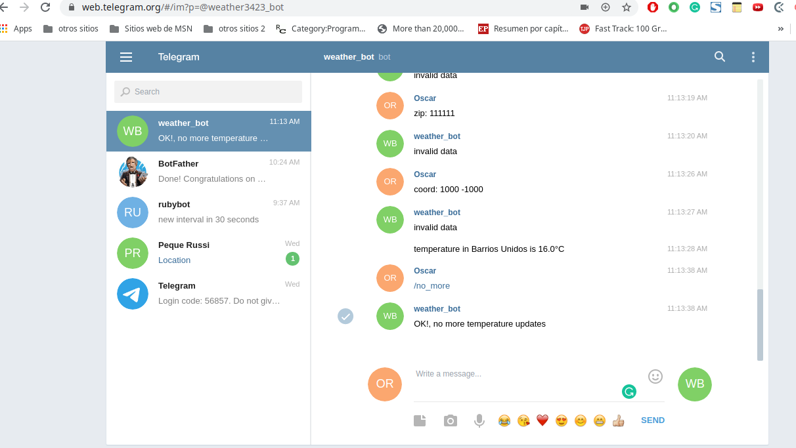
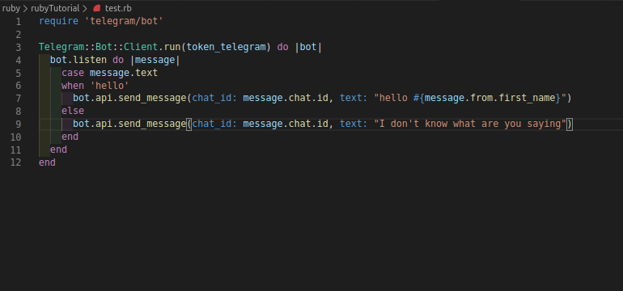

# weather-bot-ruby

Capstone project for Ruby course in Microverse

# enumerable-module-ruby test

Eight Microverse project for Ruby Course

# What it does

- I have created a bot in telegram
- This bot give info about temperature
- it can use the city name, coordinates (latitude and longitude), or zip code to get the information
- if the user shares his location bot will give him /her an update of the temperature in the city using an interval of time.
- By default the interval is 60 seconds but can be modified using /interval message
- to learn more about how to use the bot type /start and /tutorial
- To make the project work in another environment is necessary to install three gems, to do it run:
* gem install telegram-bot-ruby
* gem install openweather2
* gem install geocoder

## Built With

- Ruby
- Telegrem API [Link](https://core.telegram.org/bots/api)
- Geocoder API [Link](http://www.rubygeocoder.com/)
- Openweather2 [Link](https://openweathermap.org/)

#### and deployed to GitHub

## How to use this bot
- You need a account in telegram
- On telegram look for weather3423_bot and type **/start** to begin (or click in [Live Demo](https://web.telegram.org/#/im?p=@weather3423_bot))

## Bot Tutorial
- Type **/tutorial** for the tutorial with all the commands you can use to communicate with the bot
* **Miami**
* Get temperature of miami
* **coord:  4.5 74.25**
* Get temperature of place with latitude 4.5 and longitude 74.25
* **zip:  33101**
* Get temperature of place with zip code 33101
* **/format c**
* Use celsius format, the other options are f (farenheit) and k (kelvin)
* **/interval 10m**
* updates of temperature every 10 minutes,
* the other options are s (seconds), h (hour), d (days)
* **/no_more**
* Stop automatic updates of the temperature

## How to create a bot in Telegram

1) look for user botfather in telegram, this is the bot that control all the bots
2) type /start to request a bot
3) type name of your bot
4) save the token botfather will give you because you will need that token to control your bot
5) run **gem install telegram-bot-ruby**  and add **require "telegram/bot"** in your project
6) try something like this

In the image example the bot answer "hello name-of-the-user" if user type hello, otherwise it send the message "I dont know what are you saying"

## How to clone this project

In order to clone this project you will need
1) Have installed ruby in our computer
2) Create a bot in telegram and save the token
3) Create an account in openweathermap and request a key
4) make the installation of the next gems:
* gem install telegram-bot-ruby
* gem install openweather2
* gem install geocoder
5) Download this project
6) In bin/main.rb replace current telegram token and openweather key for your own telegram token and weather key
7) In the terminal, go to the bin folder of this project and run "ruby main.rb"
8) You can also run tests of the project with "rspec" command (run command inside the folder project), but you need to have install rspec program

## Live Demo

[Live Demo](https://web.telegram.org/#/im?p=@weather3423_bot)

## Project Presentation (Video)

[Project Presentation](https://www.loom.com/share/6a5bd2ea817a439f958324f69bdd58bc)

## Authors

**Oscar Russi**
- Github: [@andresporras3423](https://github.com/andresporras3423/)
- Linkedin: [Oscar Russi](https://www.linkedin.com/in/oscar-andres-russi-porras/)
- Twitter: [@OscarRussi1](https://twitter.com/OscarRussi1)

## 🤝 Contributing

This is a project for educational purposes only. We are not accepting contributions.

## Attributions and Credit

Special thanks to Microverse, for this learning opportunity. 

## Show your support

Give a ⭐️ if you like this project!

## Enjoy!
